# Data Visualization Basic with D3.js

D3.js is probably the de facto Javascript library for creating data visualizations in the web. It has a lot of modules and functions dedicated to translating raw data onto the screen, calculating specific graph layouts, rendering different chart types...it's amazingly comprehensive, but it's also a lot.

## Excercies

| No  | Excercise  |
|---|---|
| 1  | Smile ([link](./excercies/1-smile.html))  |
| 2  | Styling ([link](./excercies/2-styling.html))  |
| 3  | Dynamic Render ([link](./excercies/3-dynamic-render.html))  |
| 4  | Scale ([link](./excercies/4-scale.html))  |
| 5  | Group ([link](./excercies/5-group.html))  |
| 6  | Update ([link](./excercies/6-update.html))  |
| 7  | Animate Transition ([link](./excercies/7-animate-transition.html))  |
| 8  | Filter ([link](./excercies/8-filtering.html))  |
| 9  | Force Graph ([link](./excercies/9-force-graph.html))  |


<!-- ## ✨ lessons & key takeaways 

1. [Draw a flower petal on the screen](https://observablehq.com/d/c6629eb98b76cea3)
  - SVG coordinate system
  - SVG paths and the <code>d</code> attribute
2. [Select existing petal(s) and bind movie data](https://observablehq.com/d/dd416c1d85760363)
  - <code>d3.select()</code> and <code>d3.selectAll()</code>
  - <code>selection.datum()</code> and <code>selection.data()</code>
  - <code>selection.attr()</code> and <code>selection.style()</code>
3. [Create a petal for each movie](https://observablehq.com/d/f31b2033f4fe4e9f)
  - D3's enter-append pattern
  - SVG transforms (translate)
4. [Size each petal based on its movie's rating](https://observablehq.com/d/2683357905679f61)
  - <code>d3.min()</code>, <code>d3.max()</code>, <code>d3.extent()</code>
  - D3 scales
  - SVG transforms (scale)
5. [Turn petals into flowers for each movie](https://observablehq.com/d/2683357905679f61)
  - Nesting
  - SVG transforms (rotate)
6. [Add filter by options](https://observablehq.com/d/681e1e3eb92d6f08)
  - D3's update and exit patterns
  - D3 transitions
7. [Position film flowers by the genres they share](https://observablehq.com/d/a25aafa93f553da6)
  - D3 shapes and hierarchies
  - D3 force layout -->

## ✨ data visualization ecosystem & resources

- [D3.js API Reference](https://github.com/d3/d3/blob/master/API.md)
- [Bl.ocks](https://bl.ocks.org/) → [Observable](http://observablehq.com/)
- [D3.js Slack](https://d3-slackin.herokuapp.com/)
- [Data Visualization Society](https://www.datavisualizationsociety.com/)

## SVG vs Canvas

SVG (Scalable Vector Graphics)
- XML syntax
- each shape is a DOM element
- **pro:** easy to get staed and interact with
- **con:** not performant at large scale

HTML5 Canvas
- Javascript API
- One Canvas element, shapes are inaccessible one drawn
- **pro:** very performant, especially for animations
- **con:** hard to interact with

*"SVG is like Illustrator and Canvas is like Photoshop"*

Deep dive about SVG: https://www.sarasoueidan.com/blog/svg-coordinate-systems/

## SVG Element Common used

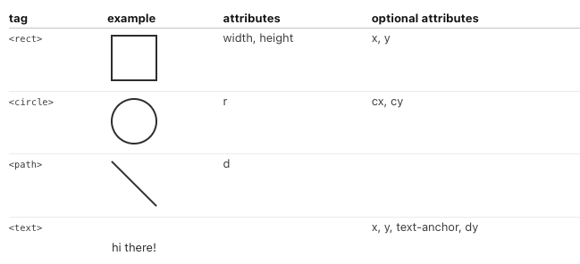

## SVG Path

**Formula**

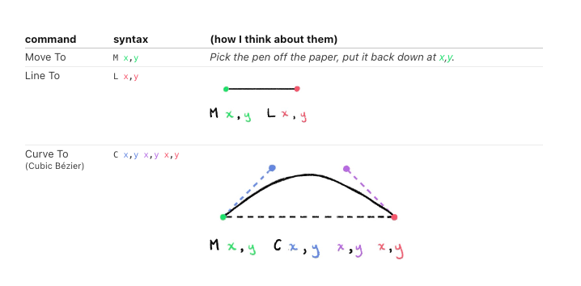

Example path to draw a flower

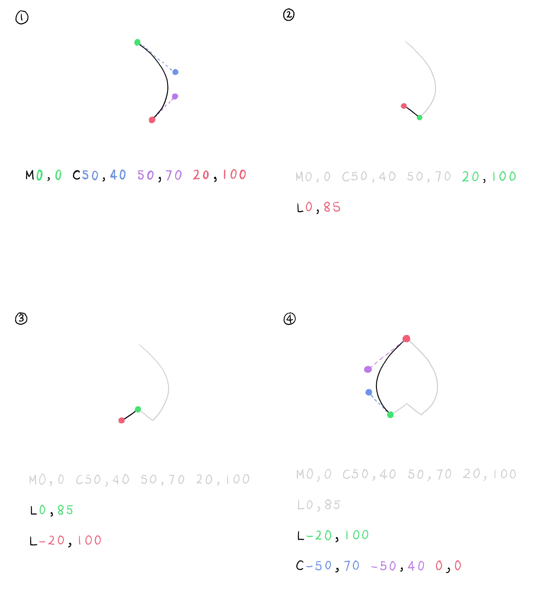

## SVG G

The  `<g>` SVG element is a container used to group other SVG elements.

Transformations applied to the `<g>` element are performed on its child elements, and its attributes are inherited by its children.


## D3 API

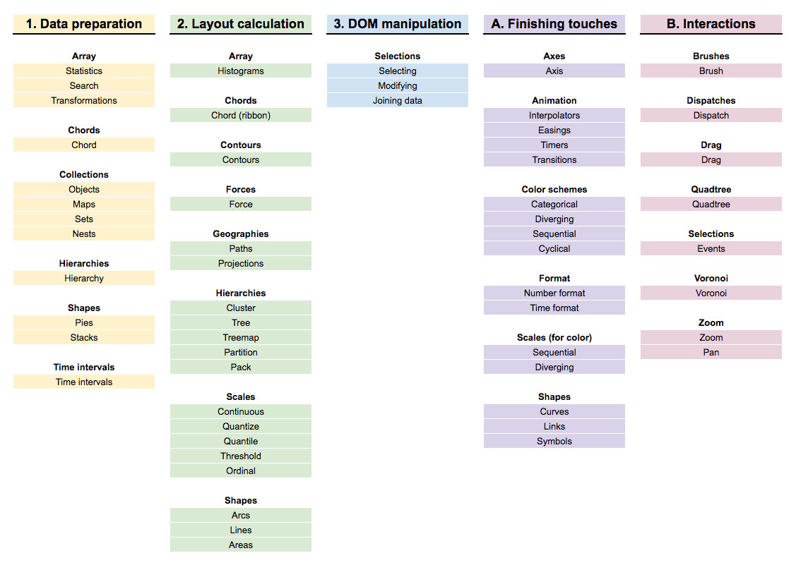

### select() and selectAll()

- [d3.select(selector)](https://github.com/d3/d3-selection/blob/v1.4.1/README.md#select)
- [d3.selectAll(selector)](https://github.com/d3/d3-selection/blob/v1.4.1/README.md#selectAll)
- [selection.select(selector)](https://github.com/d3/d3-selection/blob/v1.4.1/README.md#selection_select)
- [selection.selectAll(selector)](https://github.com/d3/d3-selection/blob/v1.4.1/README.md#selection_selectAll)

Takes in a selector string or DOM element and returns a D3.js selection.

d3.select() and d3.selectAll() query the entire DOM. selection.select() and selection.selectAll() are restricted to the descendents of the selection.

Selections allow for method chaining.

```xml
<svg id='container'>
  <rect />
  <rect />
  <rect />
  <rect />
  <rect />
</svg>
```

```js
// wrap SVG element with d3
  const svg = d3.select('#container')
  
  // select the first path in the svg selection
  // (note: selections can be chained)
  const select = svg.select('rect')
  
  // select all the paths in the svg selection
  const selectAll = svg.selectAll('rect')  
```

### selection.data() and selection.datum()

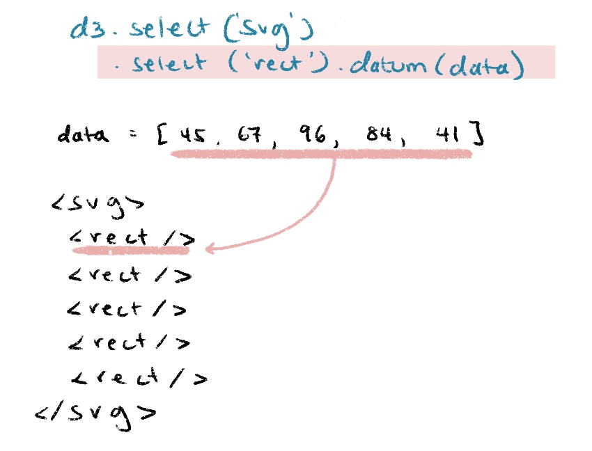

### selection.attr() and selection.style()

Selecting one or all of the SVG paths and setting attributes on them. Within a DOM element using the .attr() and .style() methods that set either the attribute or the CSS styles on elements.

```js
  const rectWidth = 50
  
  const svg = html`
    <svg width=${rectWidth * barData.length} height=100 style='border: 1px dashed'>
      <rect />
      <rect />
      <rect />
      <rect />
      <rect />
    </rect>
  `
 
  d3.select(svg).selectAll('rect')
    .data(barData)
    // calculate x-position based on its index
    .attr('x', (d, i) => i * rectWidth)
    // set height based on the bound datum
    .attr('height', d => d)
    // rest of attributes are constant values
    .attr('width', rectWidth)
    .attr('stroke-width', 3)
    .attr('stroke-dasharray', '5 5')
    .attr('stroke', 'plum')
    .attr('fill', 'pink')
  
  return svg
```

### selection.enter()

The d3.selection.enter() function in D3.js is used to create the missing elements and return the enter selection.

```js
selection.enter(); 
```

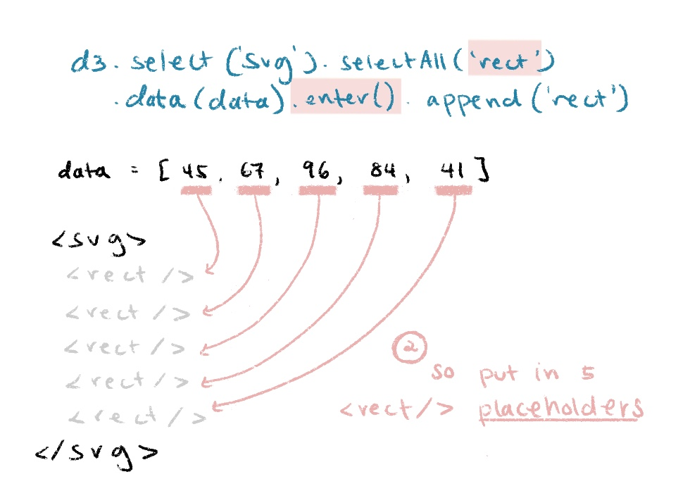

## D3 Scale

D3.js scales to translate raw data into visual channels.

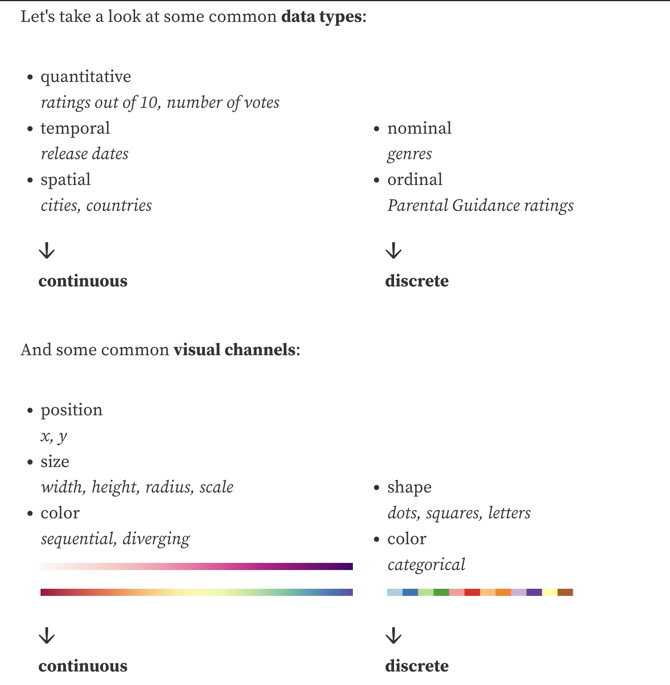

### D3 Scale methods

Scales map a dimension of abstract data to a visual representation. Although most often used for encoding data as position, say to map time and temperature to a horizontal and vertical position in a scatterplot, scales can represent virtually any visual encoding, such as color, stroke width, or symbol size. Scales can also be used with virtually any type of data, such as named categorical data or discrete data that requires sensible breaks.

This method is often used

**continuous → continuous**

- [scaleLinear()](https://github.com/d3/d3-scale#linear-scales)
- [scaleLog()](https://github.com/d3/d3-scale/tree/v2.2.2#log-scales)
- [scaleSqrt()](https://github.com/d3/d3-scale/tree/v2.2.2#scaleSqrt)
- [scaleTime()](https://github.com/d3/d3-scale/tree/v2.2.2#time-scales)

**continuous → discrete**

- [scaleQuantize()](https://github.com/d3/d3-scale/tree/v2.2.2#quantize-scales)

**discrete → discrete**

- [scaleOrdinal()](https://github.com/d3/d3-scale/tree/v2.2.2#ordinal-scales)

**discrete → continuous**

- [scaleBand()](https://github.com/d3/d3-scale/tree/v2.2.2#band-scales)

D3 Scale usage:

```js
const scale = d3.scaleLinear()
  .domain([min, max]) // raw data
  .range([min, max]) // visual channel

scale(someValue) // returns translated value

// A helper functions from d3 to get min & max values from data:

d3.min(data, d => d[someAttr])
d3.max(data, d => d[someAttr])
d3.extent(data, d => d[someAttr]) // returns [min, max]
```

## D3 Filter & Update

### the enter-update-exit pattern

**.data(data, key)**

The `.data()` function is powerful because it not only binds data to our selection and calculates the enter selection, it also calculates our update and exit selection as well.

To help with the calculation, we'll often times pass in a key function:

```js
const data = [45, 67, 96, 84, 41]
```

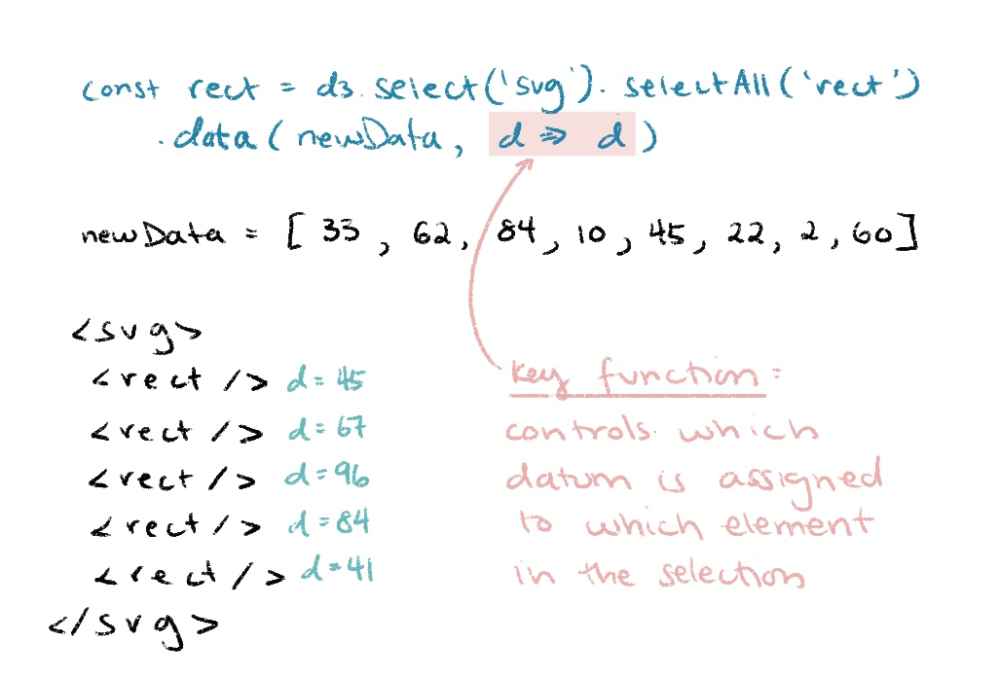

↑ this is a pretty trivial example because we're using the bound integer datum as the key. Usually we'd pass in an unique ID (within an object) and use that.

With the key function, D3.js calculates the update, exit, and enter selections:

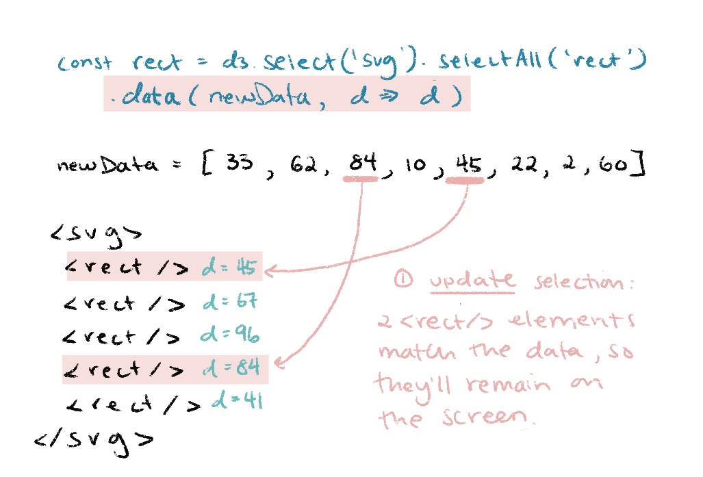
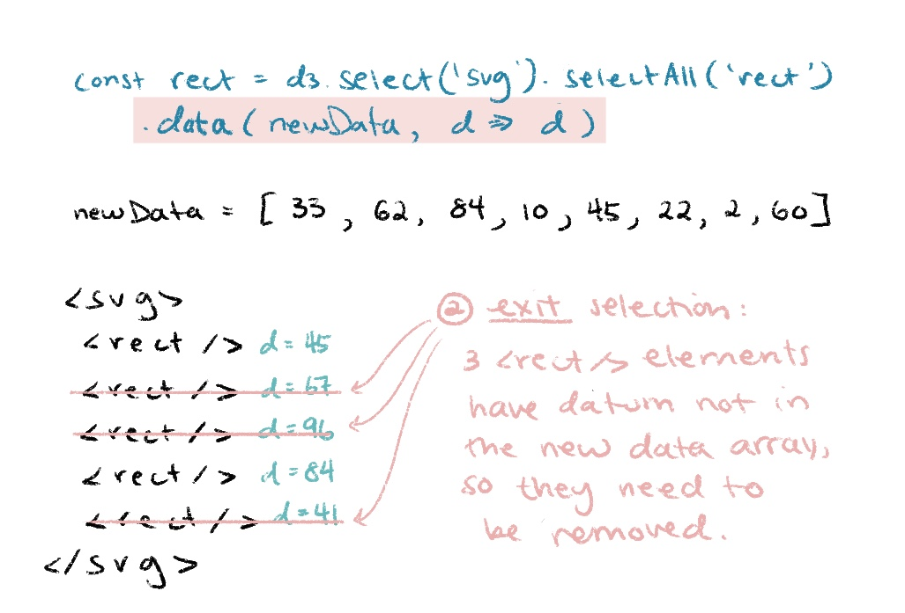
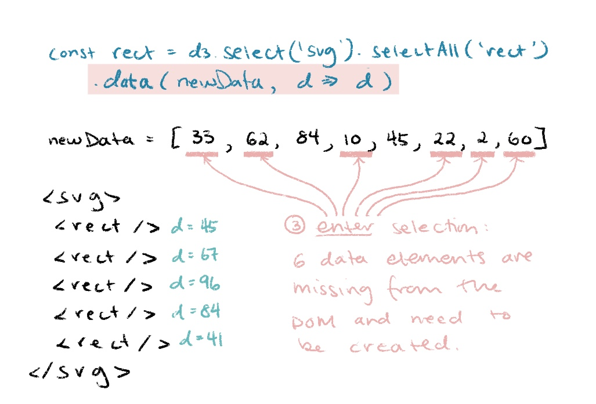

* If a key function isn't provided, D3.js defaults to using the integer as the key.

Example:

```js
d3.select(svg).selectAll('rect')
  .data(newData, d => d)
  .join('rect') // takes care of enter & exit in one
  // returns the enter+update selection,
  // so we can set all our attributes on it:
  .attr('x', (d, i) => i * rectWidth)
  .attr('width', rectWidth)
  ...

// If we want access to specific selections to operate on them:

d3.select(svg).selectAll('rect')
  .data(newData, d => d)
  .join(
    enter => {
      // return so it can be joined with update selection
      return enter.append('rect')
        // set attributes etc. on only enter selection
    },
    update => update,
    exit => {
      // do something with exit selection
    }
  )
  // .join() returns enter+update selection
  // so can also chain attributes here
  ...
```

## D3.js transitions

Transitions are how we animate attributes and styles from one state to the next in D3.js. This is really important for us to maintain object constancy, so that we can visually keep track of all the updates happening.

D3.js has a lot of support for controlling the timing, easing, chaining, or even creating custom animations, but for today, we'll cover the simplest (but still powerful) way to use D3.js transitions.

```js
// define the transition
const t = d3.transition().duration(1000)

selection
  // attributes or styles to transition FROM
  .transition(t)
  // attributes or styles to transition TO
```

> D3.js knows to animate the attributes or styles that comes after .transition(t), and will use those as the values to transition to. 🚨 If there are no corresponding attribute declarations before .transition(t), D3.js will use the SVG element's defaults to transition from.

## D3 Shape

[D3.js shape](https://d3js.org/d3-shape) functions help to calculate the path strings we need to draw line charts, area charts, pie charts, etc. They take in raw data and return path strings. https://d3js.org/d3-shape

## D3.js hierarchy

[D3.js hierarchy](https://d3js.org/d3-hierarchy) helps us calculate the x, y-positions and (where applicable) the width, height, radius for trees, tree maps, circle maps, etc. They also take in the raw data and return new objects without mutating the original data. https://d3js.org/d3-hierarchy

## D3.js force

The [D3.js force](https://d3js.org/d3-force) layout is probably my favorite layout module because of how powerful it is. It's a little bit different from the others I've already mentioned, because it directly mutates the data we pass in and requires upwards of thousands of calculations instead of one single one.

More deep dive about force: https://medium.com/@sxywu/understanding-the-force-ef1237017d5

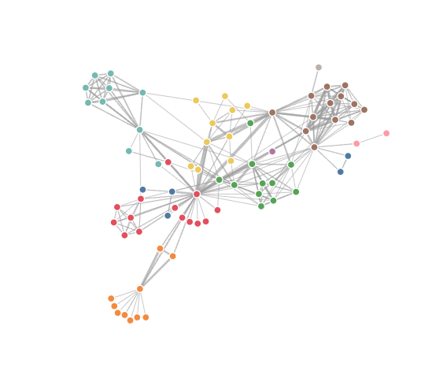

This is the relevant code from the Les Mis example above:

```js
const simulation = d3.forceSimulation(nodes)
  .force("link", d3.forceLink(links).id(d => d.id))
  .force("charge", d3.forceManyBody())
  .force("center", d3.forceCenter(width / 2, height / 2))
  .on("tick", () => {
    // update node and link positions
  })
```

Let's break down what D3.js is doing underneath the hood:

1. Takes array of nodes and assigns a random x, y-position to each of them
2. Loops through each node and applies the series of forces specified in .force():
  - Attractive forces pull nodes together to conserve space (e.g. links between nodes)
  - Negative forces push nodes apart to avoid overlap between them (e.g. negative charges and collision forces)
  - All of these forces together nudge the node positions slightly, and these series of calculations happen in one "tick"
3. Runs thousands of "ticks" until the nodes are nudged to their "optimal" positions

To use the calculated node and link positions, we update the corresponding DOM elements either on each "tick" `(.on('tick', () => ...))` or on simulation end `(.on('end', () => ...))`.